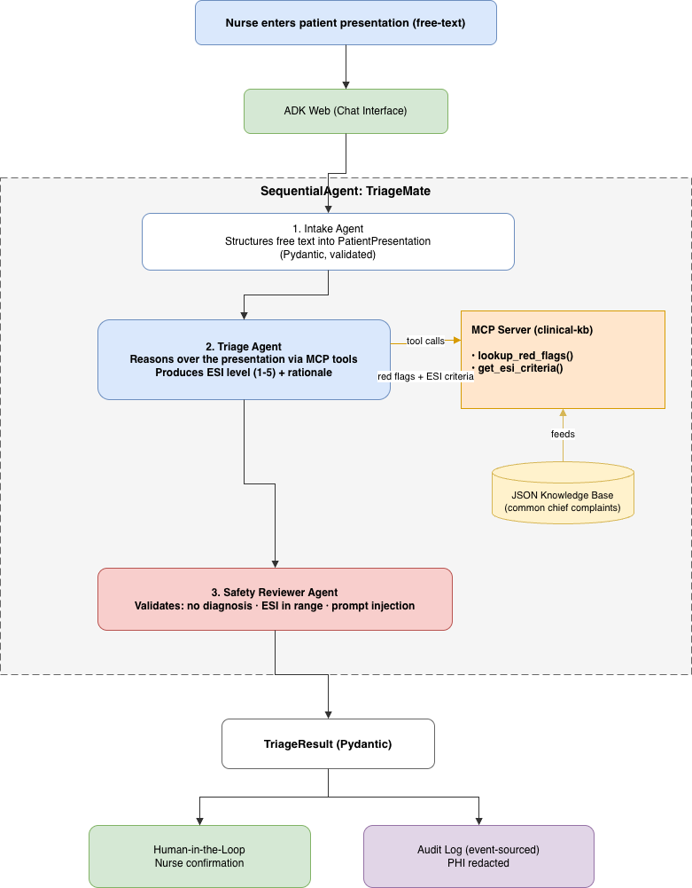

# TriageMate — AI Triage Copilot for Nurses

> Decision support, not decision making. A nurse always confirms the final call.

TriageMate turns a nurse's free-text description of a patient into a structured,
safety-reviewed **Emergency Severity Index (ESI 1–5)** recommendation in seconds —
checking the presentation against clinical red flags and keeping a privacy-safe
audit trail of every decision.


---

## The problem

In an emergency department or under-resourced clinic, the **triage nurse** is the
first decision point: who is seen now, who can safely wait. Two pressures make this
hard and dangerous:

- **Overload & staffing gaps.** Decisions are made in seconds, often by junior staff
  or in rural clinics without an experienced triage lead.
- **Mis-triage is costly.** *Under-triage* (sending a heart attack to the waiting
  room) can be fatal; *over-triage* clogs the ED. Triage requires holding vitals,
  history, red-flag protocols, and an acuity scale in mind all at once.

## Why an agent (and not a form or a rule engine)

Triage is not a lookup — it is **reasoning over messy free text + structured signals
+ protocols, then a judgment**. An agent can structure the unstructured input, *call
tools* to screen red flags, reason about acuity, and explain its recommendation —
while a deterministic safety layer guarantees it never oversteps. Crucially it is a
**copilot**: it augments the nurse and the nurse confirms.

## Solution at a glance

A nurse types a presentation → TriageMate structures it → screens it against a
clinical knowledge base over MCP → assigns an ESI level with a transparent rationale
→ a safety reviewer validates it → the nurse confirms. Every decision is logged with
PHI redacted.

---

## Architecture



> Source diagram: [`docs/architecture.drawio`](docs/architecture.drawio)
> (open in the draw.io VS Code extension; export to `docs/architecture.png` for the writeup).

A **`SequentialAgent`** orchestrates three specialist ADK agents:

| # | Agent | Role | Output |
|---|-------|------|--------|
| 1 | **Intake** | Structures free text into a validated `PatientPresentation` | `presentation` |
| 2 | **Triage** | Reasons over the presentation, calling the **MCP clinical-kb** tools (`lookup_red_flags`, `get_esi_criteria`) | `triage_draft` |
| 3 | **Safety Reviewer** | Validates the draft, enforces the no-diagnosis mandate, emits a structured `TriageResult` | `triage_result` |

Deterministic guardrails wrap the LLM agents via ADK callbacks:

- **Input** (`before_model_callback` on Intake): PHI redaction + prompt-injection detection.
- **Output** (`after_agent_callback` on Safety Reviewer): result validation + PHI-redacted audit event.

---

## Course concepts demonstrated

| Concept | How it shows up | Where |
|---------|-----------------|-------|
| **Agent / Multi-agent (ADK)** | 3-agent `SequentialAgent` pipeline with shared session state | [`triage_agent/agent.py`](triage_agent/agent.py) |
| **MCP Server** | A real stdio MCP server exposing two clinical-knowledge tools | [`mcp_server/server.py`](mcp_server/server.py) |
| **Security features** | PHI redaction, prompt-injection defense, output validation, no-diagnosis guardrail, audit log + STRIDE model | [`triage_agent/guardrails.py`](triage_agent/guardrails.py), [`threat_model.md`](threat_model.md) |
| **Agent Skills** | Modular `SKILL.md` procedures loaded into agent instructions | [`skills/`](skills/) |
| **Deployability** | Containerized; runs identically locally or on a managed runtime | [`Dockerfile`](Dockerfile) |

---

## Setup

Requires [uv](https://docs.astral.sh/uv/) and Python 3.11–3.13.

```bash
# 1. Install dependencies into a local .venv
make install            # = uv sync --all-extras

# 2. Provide your Gemini API key (free at https://aistudio.google.com/apikey)
cp .env.example .env
# edit .env and set GEMINI_API_KEY=...

# 3. Run the test suite (no API key or network needed)
make test

# 4a. Launch the course playground (agents-cli) — opens the chat UI on triage_agent
agents-cli playground          # or: make playground

# 4b. Or run a headless, reproducible demo (no UI)
uv run python demo.py
```

### Try it

Paste a presentation into the chat, for example:

> 58-year-old man, crushing chest pressure radiating to the left arm for 20 minutes,
> sweaty and nauseous. HR 110, SpO2 95%.

TriageMate will structure it, screen red flags via MCP, and return an ESI level with
a rationale for the nurse to confirm. The decision is appended to `audit_log.jsonl`
with any PHI redacted.

---

## Project structure

```
triagemate/
├── triage_agent/          # ADK agent package (adk web discovers this)
│   ├── agent.py           # 3 agents + MCP toolset + guardrail callbacks + SequentialAgent
│   ├── schemas.py         # PatientPresentation, TriageResult (Pydantic contracts)
│   ├── guardrails.py      # PHI redaction, injection detection, output validation
│   ├── audit.py           # append-only PHI-redacted audit log
│   ├── skills.py          # SKILL.md loader
│   └── config.py
├── mcp_server/
│   ├── server.py          # clinical-kb MCP server (stdio, FastMCP)
│   └── knowledge_base.json# curated ESI criteria + red flags
├── skills/                # modular agent skills
│   ├── symptom-analysis/SKILL.md
│   └── red-flag-detection/SKILL.md
├── tests/test_guardrails.py
├── docs/architecture.drawio
├── threat_model.md        # STRIDE analysis
├── Dockerfile  Makefile  pyproject.toml
```

---

## Safety & scope

TriageMate is **decision support, not a medical device**. It assigns acuity routing
only — never a diagnosis or treatment — and `requires_nurse_confirmation` is always
true. The knowledge base is a curated demo subset, not a certified protocol. See
[`threat_model.md`](threat_model.md) for the full STRIDE analysis and residual risks.

### Production hardening (documented, not implemented)
Authenticated clinical SSO, a certified PHI de-identifier (NER-based), a complete
protocol set reviewed by clinicians, and persistent encrypted audit storage.
